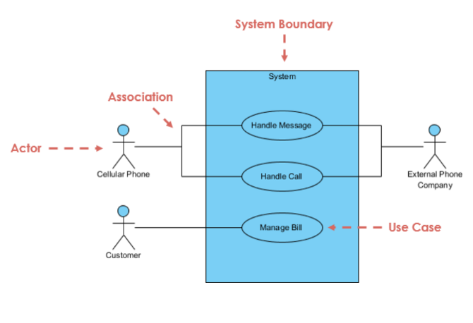
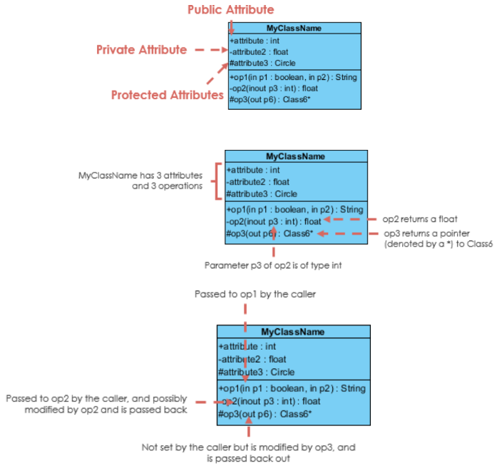
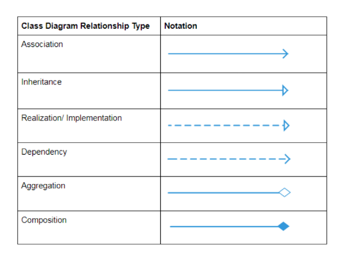
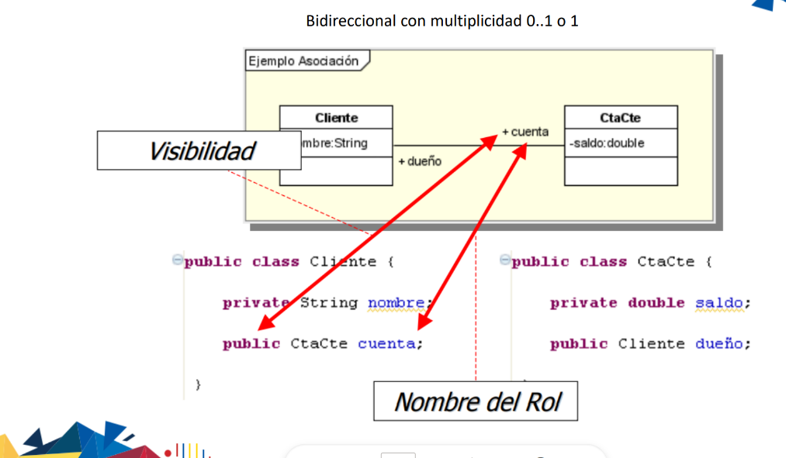
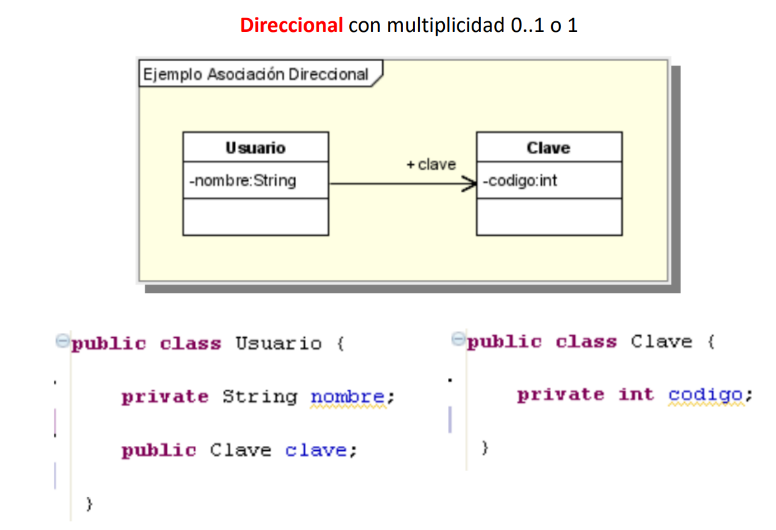
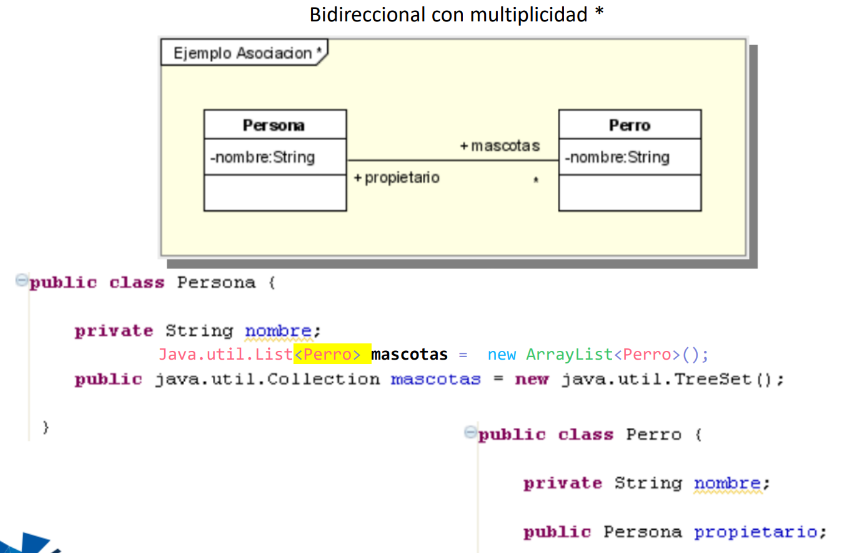

# RESUMEN CLASES PROGRAMACIÓN

#### Nombre: Francisco Morales

#### Asignatura: Programacion II 

### RECOMENDACIONES DE INICIO

- Actitud positiva
- Coompanerismo
- Personalizacion del Entorno
    - Tema
    - Personalizacion termital Git Bash
    - Instalación de extensiones
    - Configuración de la fuente y tamaño de letra
    - Configuracion de Iconos y Botones de Acceso Rapido
- Aprender los Atajos del Teclado
- Practicar Typing

### USO DE GIT - GITHUB

Pasos Iniciales

1. Instalar GIT BASH
2. Seleccionar en Visual Code la Terminal de Git Bash para que aparesca por defecto
3. Crear una cuenta en GitHub
4. Sincronizar VSCode con GitHub

### Que es Git?

Permite llevar un registro detallado de cada cambio realizado en el código. 

Esto facilita la revisión histórica de versiones anteriores, la comparación de cambios y la recuperación de versiones específicas en caso de necesidad.

Facilita el trabajo en equipo al permitir que varios desarrolladores trabajen simultáneamente en el mismo proyecto.

Permite revertir cambios no deseados de manera efectiva y restaurar versiones anteriores del código. Util en situaciones donde se introducen errores o se necesitan restauraciones rápidas.

Cuando múltiples desarrolladores modifican el mismo archivo, Git ayuda a gestionar y resolver conflictos de manera efectiva durante la fusión de ramas

Proporciona herramientas para comparar versiones, elegir qué cambios conservar y cómo integrarlos correctamente.

### Que es GitHub?

GitHub permite a los desarrolladores almacenar repositorios Git de forma remota en la nube. 

Esto proporciona una ubicación centralizada para el código fuente y facilita el acceso y la colaboración entre diferentes miembros del equipo.

GitHub facilita la colaboración entre desarrolladores permitiendo a los equipos trabajar juntos en proyectos compartidos.

Los desarrolladores pueden clonar repositorios, enviar y recibir cambios mediante pull requests, revisar el código de otros, y colaborar en la resolución de problemas utilizando problemas (issues) y comentarios.

GitHub proporciona herramientas para la gestión de proyectos que permiten a los equipos organizar tareas, asignar responsabilidades, realizar seguimiento del progreso y establecer hitos utilizando tableros Kanban, listas de tareas y etiquetas.

GitHub permite configurar permisos granulares para controlar quién puede acceder y realizar cambios en los repositorios y proyectos.

Los administradores pueden gestionar usuarios, equipos y colaboradores externos, asegurando la seguridad y la privacidad del código.

GitHub se integra con una amplia gama de herramientas de desarrollo como integración continua (CI), despliegue continuo (CD), sistemas de seguimiento de problemas, herramientas de revisión de código y más.

Los pull requests en GitHub permiten a los desarrolladores proponer cambios específicos en un repositorio y solicitar que se revisen y se fusionen en la rama principal.

Esto facilita la revisión del código por parte de otros desarrolladores, la discusión de cambios y la colaboración para mejorar la calidad del código.

### Comandos Generales Linux

```
ls
```

Lista los archivos y directorios en el directorio actual.

```
cd [directorio]
```

Cambia el directorio actual a otro directorio especificado.

```
pwd
```

Muestra la ruta completa del directorio actual (print working directory).

```
mkdir [nombre_directorio]
```

Crea un nuevo directorio con el nombre especificado.

```
rm [archivo/directorio]
```

Elimina archivos o directorios. Añadiendo la opción -r se pueden eliminar directorios de forma recursiva.

```
cp [archivo_origen] [archivo_destino]
```

Copia archivos o directorios. La opción -r se utiliza para copiar directorios recursivamente.

```
mv [origen] [destino]
```

Mueve archivos o directorios de un lugar a otro. También se utiliza para cambiar el nombre de archivos.

```
touch [nombre_archivo]
```

Crea un archivo vacío con el nombre especificado.

```
cat [archivo]
```

Muestra el contenido completo de un archivo en la terminal.

```
less [archivo]
```

Permite ver el contenido de un archivo página por página.

```
head [archivo]
```

Muestra las primeras líneas de un archivo.

```
tail [archivo]
```

Muestra las últimas líneas de un archivo.

```
grep [patrón] [archivo]
```

Busca patrones de texto dentro de archivos.

### Comandos Generales Git

```
git init
```

Inicializa un nuevo repositorio Git en el directorio actual.

```
git clone [url]
```

Clona un repositorio Git existente desde una URL remota al directorio local.

```
git status
```

Muestra el estado actual del repositorio, incluyendo archivos modificados, nuevos archivos y archivos listos para ser confirmados.

```
git add [file]
```

Agrega archivos específicos al área de preparación (staging area) para ser incluidos en el próximo commit.
```
git commit -m "mensaje"
```

Crea un nuevo commit con los archivos que están en el área de preparación y los guarda en el repositorio.
```
git pull
```

Obtiene los cambios más recientes desde el repositorio remoto y los fusiona con tu rama local.
```
git push
```

Envía tus commits locales al repositorio remoto.
```
git branch
```

Lista todas las ramas locales y muestra la rama actual.
```
git checkout [branch/tag]
```

Cambia a otra rama o restaura archivos desde un commit específico.

```
git merge [branch]
```

Fusiona una rama específica en la rama actual.

```
git remote -v
```

Muestra las URLs de los repositorios remotos asociados con tu repositorio local.

```
git log
```

Muestra un registro de commits realizados en la rama actual.

```
git diff [file]
```

Muestra las diferencias entre los cambios en el archivo que no han sido preparados (staged) y la versión actual.

```
git reset [file]
```

Deshace los cambios realizados en un archivo y lo saca del área de preparación.

```
git stash
```

Guarda temporalmente los cambios locales sin commit para que puedas trabajar en otra cosa y luego aplicarlos más tarde.

### EXTENSIONES

- Debugger for Java
- Java Extension Pack
- CMake
- Draw.io
- GitLens
- Drawio Preview
- Excalidraw
- Markdown Extensions

### JAVA

Instalacion de JDK

Instalacion de Complemento Java en Visual Code

Standar de trabajo en java -> camelspace

EJEMPLO: animalTortuga

#### ESTRUCTURAS DE REPETICION O BUCLES

- For
- While
- Do While

Se aplican mediante el uso de:

- VARIABLE (i = 0)
- CONDICION (i < numero)
- INCREMENTO (i++)

OJO: SE DEBE EVITAR LA CREACION DE BUCLES INFINITOS 

## UML

### DIAGRAMA DE CASO DE USO Y DIAGRAMA DE CLASES

1986 Jacobson Ivar, primero en usar.

Busca desarrollar la etapa inicial de un proyecto:

- Especificar el contexto del sistema
- Capturar los requisiitos de  un sistema
- Validar una arquitectura de sitemas
- Identifica los componentes principales del sistema
- Actor





## POO (PROGRAMACION ORIENTADA A OBJETOS)

Paradigma - Solucionar problemas

### 1. Conceptalización

Prototipado - Dibujar - Idea

Definir propiedades(Caracteristicas) y metodos(Acciones)

#### Propiedades

(Almacenar informacion - Datos) ----------> NO SALIR DEL CONTEXTO.
    Necesita un proceso de descripcion

#### Metodo

(Accion - Necesita de un parametro y un Ambito)

##### Parametro

(Infromacion necesaria para la realizacion de una accion)

##### Ambito

- Public "+"(Acceso para Cualquiera)
- Private "-"
- Protect "~"(Por herencia)
- Friendly "#"(Acceso para un grupo o paquete)

### 2. Modelado - UML

Formato para describir el concepto

|------ Clase ------| 

|------ Propiedades  o  Atributos ------|

DEBE INDICAR AL INICIO EL AMBITO, EN FORMATO CAMELSCALE Y INDICAR EL TIPO DE DATO.

|------ Metodos -----|

DEBE INDICAR AL INICIO EL AMBITO, LOS PARAMETROS QUE CONTIENEN CON SU TIPO DE DATO. Y EL VALOR QUE RETORNA.

PUEDE RETORNAR VALOR O NO.
VOID (Solo interesa que realize la accion)
TIPO DE DATO (Retorno de un dato)

|------ Evento ------|

DEBE INDICAR AL INICIO EL AMBITO, NOMBRE DE OBJETO Y EL OBJETO COMO TAL.

INTERACCION CON OTRO OBJETOS

### 3. Escritura del Codigo

``` 
Public class Mujer{
    private float edad;
    public bool tieneOjos;

    protected string bailar (String Cancion, int tiempoMin, String Ritmo){
        ---------------------;
        ---------------------;
        return "Baile de maravilla":
    }
}
```

### 4. GETTER - SETTER

Los setter y getter son métodos utilizados en la programación orientada a objetos para controlar el acceso a los atributos de una clase.

Setter:

Es un método que se utiliza para asignar un valor a un atributo privado de una clase. Generalmente, los setters tienen el prefijo "set" seguido del nombre del atributo que están modificando. 

Los setters suelen incluir validaciones para asegurar que el valor asignado cumpla ciertas condiciones.

Getter:

Es un método que se utiliza para obtener el valor de un atributo privado de una clase.

Los getters tienen el prefijo "get" seguido del nombre del atributo que están obteniendo. 

Los getters permiten el acceso controlado a los datos almacenados en un objeto.

#### Ejemplo

```
public void setNombre(String nombre) {
    // Aquí podríamos incluir validaciones si fuera necesario
    this.nombre = nombre;
}
```

```
public String getNombre() {
    return this.nombre;
}
```
### 5. CONSTRUCTORES

Ayuda a dar puntos de inicio al objeto (Inicializar variables).

- Suele estar predefinido por defecto.
- El programador puede establecer uno propio.
- Se ejecuta automaticamente.

#### Caracteristicas

1. Mismo nombre que la clase
2. Siempre es publico, protegido
3. Esta por defecto
4. Es un metodo, se lo llama una sola vez.
5. Automatico en la misma instancia
6. No se deben definir

#### Ejemplo
```
public Perro(){
    nombre = "";
}
```
#### Sobrecarga

Ocurre al crear dos constructores.

Con la diferencia en la que una no recibe parametros y la otra si.

En ese caso al llamar al constructor este realizara uno u otro en funcion de los parametros otorgados.

##### Ejemplos
```
public Perro(String nombre){
    this.nombre = nombre;
    raza = "";
}
```

```
public Perro(String nom, String ra){
    nombre = nom;
    raza = ra;
}
```
```
Perrop1 = new Perro("firu")
Perrop2 = new Perro("firu", "Delmer")
```

### 6. ASOCIACION

Un propietario tiene una mascota

O

Una mascota tiene un propietario

```
propietario ----- Mascota
```

Un propietario tiene una mascota

```
propietario ----P> Mascota
```
```
propietario -----> Mascota
```

### 7. HEREDAR

En Java, la herencia es un principio fundamental de la programación orientada a objetos que permite a una clase heredar características (atributos y métodos) de otra clase. 

La clase que hereda se denomina subclase o clase hija, y la clase de la cual se hereda se denomina superclase o clase padre.

Extends (extends keyword): 

En Java, la herencia se especifica utilizando la palabra clave extends. Al utilizar extends, una clase hija puede heredar métodos y variables de su clase padre.

```
class Coche extends Vehiculo {}
```

### 8. INTERFACES

#### Caracteristicas

\-> Agrega comportamientos.
\-> Propiedades en algunos casos.
\-> No se instancean.
\-> No se heredan.


#### Condiciones

1. Comienza con i
2. Debe ser abstracta y publica
3. Solo hace acciones

#### Ejemplo:

```
public interface Actor().
```

#### UML

Se escribe siempre iniciando con "I"

##### Ejemplo

IComportamientoNatural

#### Simbolo

---->

### 9. PAQUETES

En Java, los paquetes son una forma de organizar y gestionar conjuntos de clases y interfaces relacionadas de manera estructurada.

Proporcionan varios beneficios en términos de modularidad, organización y control de acceso en grandes proyectos de desarrollo de software.

A nivel:

1. Fisico organizar en carpetas
2. Logico con "Import y package"

### 10. ABSTRACT

En Java, las clases abstractas son clases que no se pueden instanciar directamente, sino que se utilizan como plantillas o modelos para otras clases.

Las clases abstractas permiten definir una estructura común y obligar a las clases hijas a implementar ciertos métodos.

Una clase abstracta se declara utilizando la palabra clave abstract antes de la palabra class. Puede contener tanto métodos abstractos como métodos concretos.

```
public abstract class Animal {}
```

### 11. INSTANCEAR

Instancear en Java se refiere al proceso de crear un objeto específico de una clase utilizando la palabra clave new.

Cuando instancias un objeto en Java, estás creando una copia única de la clase en memoria, que puede ser manipulada y utilizada según las especificaciones definidas por esa clase.

```
Persona persona1 = new Persona();
```

## SEGUNDO BIMESTRE

### Implementacion de Interfaces

Interface no comparte codigo pero si obligaciones.

No se debe declara variable

Se comparten las que sean generales

### Asociacion

Expresa una comunicacion entre clases.

esta representado por una linea (BIDIRECCIONAL) o una linea con flecha (UNA DIRECCION).

#### Cardinalidad

Cantidad de objetos que se relacionan entre si.

Representado por los siguientes rangos.

- 1 (Solo uno)
- 0..1 (cero o uno)
- n..m (varios a varios)
- n (Indica cuantas relaciones puede haber)
- *.. (cero o mas)
- 0..* (cero o mas - lo mismo que lo anterior)
- 1..* (uno o mas)

Si se tiene un numero mayor a 1 se debe USAR UN ARRAY O COLECCION.

Se asocia con la frase un X tiene un\a y.

Las flechitas son variables

##### Collection

Almacena de forma generica. 

##### List

Almacena un tipo en especifico.

#### Ejemplo



- Se pone al contrario el objeto a crear.
- Generalmente es positivo.

P<-----G

Solo se puede asociar en una direccion




#### Relacion de Recursividad

1..*


```


```